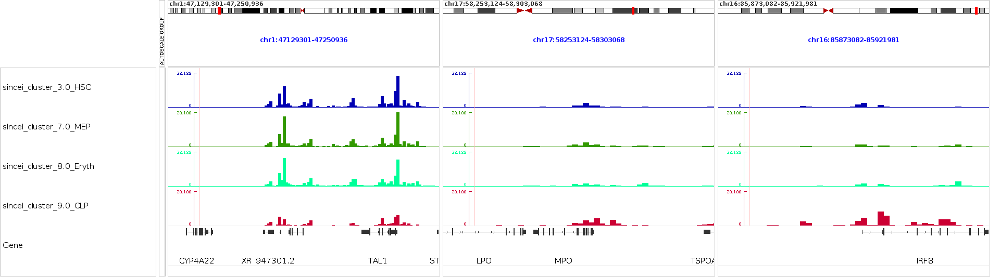

Analysis of 10x genomics scATAC-seq data using sincei
=====================================================

The data used here is produced in our :doc:`10x genomics multiome tutorial <sincei_tutorial_10x>`.

We will use the BAM files, barcodes and peaks.bed file obtained from the **cellranger-arc**
workflow. Alternatively, the BAM file (tagged with cell barcodes) and peaks.bed can be obtained from
a custom mapping/peak calling workflow, and the list of filtered cell barcodes can be obtained using
sincei (see the :doc:`parent tutorial <sincei_tutorial_10x>` for explanation).

Define common bash variables:

.. code:: bash

   cd 10x_multiome_testdata
   # create dir
   mkdir sincei_output/atac

Additionally, we will need a blacklist file to filter out reads aligned to known problematic regions
of the human genome. This file and blacklists for other genome assemblies can be downloaded from the
`Boyle lab ENCODE blacklist repository <https://github.com/Boyle-Lab/Blacklist>`__.

.. code:: bash

   wget -O hg38-blacklist.v2.bed.gz https://github.com/Boyle-Lab/Blacklist/blob/master/lists/hg38-blacklist.v2.bed.gz

2. Quality control - I (read-level)
-----------------------------------

In order to identify high quality cells for our analysis, we can use the read-level quality
statistics from :ref:`scFilterStats`. Low quality cells in this data can be identified using several
criteria, such as:

- high number of PCR duplicates (filtered using `--duplicateFilter`)
- high fraction of reads aligned to blacklisted regions (filtered using `--blackListFileName`)
- high fraction of reads with poor mapping quality (filtered using `--minMappingQuality`)
- vey high/low GC content of the aligned reads, indicating the reads were mostly aligned to
  low-complexity regions (filtered using `--GCcontentFilter`)
- high level of secondary/supplementary alignments (filtered using `--samFlagExclude/Include`)

.. code:: bash

   for rep in rep1 rep2
   do
      bamfile=cellranger_output_${rep}_atac_possorted_bam.bam
      barcodes=sincei_output/atac/atac_barcodes_filtered_${rep}.txt # from sincei or cellranger output
      blacklist=hg38-blacklist.v2.bed

      scFilterStats -p 8 \
         --region chr1 \
         --GCcontentFilter '0.2,0.8' \
         --minMappingQuality 10 \
         --samFlagInclude 64 \
         --samFlagExclude 256 \
         --samFlagExclude 2048 \
         --blackListFileName ${blacklist}  \
         --barcodes ${barcodes} \
         --cellTag CB \
         --label atac_${rep} \
         -o sincei_output/atac/scFilterStats_output_${rep}.tsv \
         -b ${bamfile}
   done

:ref:`scFilterStats` summarizes these outputs as a table, which can then be visualized using the
`MultiQC tool <https://multiqc.info/docs/>`__, to select appropriate list of cells to include for
counting.

.. code:: bash

   multiqc sincei_output/atac/ # results in multiqc_report.html

3. Signal aggregation (counting reads)
--------------------------------------

Below we aggregate the signal from single-cells, using the ``atac_peaks.bed`` file, which contains
regions of local signal enrichment detected using the ``cellranger-arc`` workflow.

Since we get a seperate peaks file from each replicate, we can run sincei on the union of the peaks
detected on each sample.

If needed, we can use the same parameters as in :ref:`scFilterStats` to count only high quality reads
from our whitelist of barcodes. We avoid counting reads in blacklisted regions of the human genome.

.. code:: bash

   for rep in rep1 rep2
   do
      bamfile=cellranger_output_${rep}_atac_possorted_bam.bam
      barcodes=sincei_output/atac/atac_barcodes_filtered_${rep}.txt # from sincei or cellranger output
      peaks_bed=atacPeaks_replicateMerged.bed

      scCountReads features -p 8 \
         --region chr1 \
         --BED ${peaks_bed} \
         --minMappingQuality 10 \
         --samFlagInclude 64 \
         --samFlagExclude 2048 \
         --extendReads \
         --blackListFileName ${blacklist} \
         --barcodes ${barcodes} \
         --cellTag CB \
         -o sincei_output/atac/scCounts_atac_peaks_${rep} \
         --label atac_${rep} \
         -b ${bamfile}
   done
   # Number of features found: 33740

4. Quality control - II (count-level)
-------------------------------------

After counting, it is recommended to perform QC on these counts, in order to filter regions and
cells that have low counts, or have low enrichment of counts. Even though we already performed
read-level QC before, the counts distribution on our specified regions (bins/genes/peaks) could be
different from the whole-genome stats.

We can run :ref:`scCountQC` on the count data to get various statistics at region and cell level.
Running this tool with the ``--describe`` flag lists the metrics that can be used to filter
cells/regions.

.. code:: bash

   # list the metrics we can use to filter cells/regions
   for rep in rep1 rep2
   do
      scCountQC -i sincei_output/atac/scCounts_atac_peaks_${rep}.h5ad --describe
   done

The tool :ref:`scCountQC` can be used for count-level QC and filtering of count data. With the
``--outMetrics`` option, the tool outputs the count statistics at region and cell level (labelled as
``<prefix>.regions.tsv`` and ``<prefix>.cells.tsv``). Just like :ref:`scFilterStats`, these outputs
can then be visualized using the `MultiQC tool <https://multiqc.info/docs/>`__, to select
appropriate metrics to filter out the unwanted cells/regions.

.. code:: bash

   # export the single-cell level metrics
   for rep in rep1 rep2
   do
      scCountQC -i sincei_output/atac/scCounts_atac_peaks_${rep}.h5ad -om sincei_output/atac/countqc_atac_peaks_${rep}
   done

   # visualize output using multiQC
   multiqc sincei_output/atac/ # see results in multiqc_report.html

In this example, we detect ~18.5k peaks in ~13.5K cells.

Below, we perform some basic filtering using :ref:`scCountQC`. We exclude the cells with <500 and
>10000 detected peaks (``--filterRegionArgs``). We also exclude peaks detected in too few cells
(<100) or in >90% of cells (``--filterCellArgs``).

.. code:: bash

   for rep in rep1 rep2
   do
      scCountQC -i sincei_output/atac/scCounts_atac_peaks_${rep}.h5ad \
         -o sincei_output/atac/scCounts_atac_peaks_filtered_${rep}.h5ad \
         -om sincei_output/atac/scCounts_atac_peaks_filtered_${rep} \
         --filterRegionArgs "n_cells_by_counts: 100, 5500" \
         --filterCellArgs "n_genes_by_counts: 200, 5000"
   done

   ## rep 1
   # Applying filters
   # Cells post-filtering: 1092
   # Features post-filtering: 7642
   ## rep 2
   # Applying filters
   # Cells post-filtering: 1038
   # Features post-filtering: 7923

5. Combine counts for the 2 replicates
--------------------------------------

While it is recommended to perform count QC separately for each replicate, the counts can now be
combined into one file for more convenient for downstream analysis. We provide a tool
:ref:`scCombineCounts`, which can concatenate counts for cells based on common features (in
``multi-sample`` mode). It can also be used to concatenate different modalities based on a common
set of cells (in ``multi-modal`` mode).

Concatenating the filtered cells for the 2 replicates results in a total of ~12K cells.

.. code:: bash

   scCombineCounts \
      -i sincei_output/atac/scCounts_atac_peaks_filtered_rep1.h5ad \
      sincei_output/atac/scCounts_atac_peaks_filtered_rep2.h5ad \
      -o sincei_output/atac/scCounts_atac_peaks_filtered.merged.h5ad \
      --method multi-sample \
      --labels rep1 rep2
   # Combined cells: 2130
   # Combined features: 7399

5. Dimensionality reduction and clustering
------------------------------------------

The tool :ref:`scClusterCells` provides a range of options to reduce the dimensionality of our count
data, while preserving biological signal. This can be specified with ``--method`` option. Below, we
will use a topic modeling method called Latent Semantic Analysis (LSA) to reduce the dimensionality
of our data to 30 topics (the default). The tool then performs Leiden clustering, and presents a
UMAP (dimensionality reduction to 2 dimensions) plot of the output (``--outFileUMAP`` option). This
option also creates a tsv file with the UMAP coordinates and assigned cluster for each cell in our
data.

.. code:: bash

   scClusterCells -i sincei_output/atac/scCounts_atac_peaks_filtered.merged.h5ad \
      -m LSA \
      -n 30 \
      --clusterResolution 1 \
      -op sincei_output/atac/scClusterCells_UMAP.png \
      -o sincei_output/atac/scCounts_atac_peaks_clustered.h5ad
   # Coherence Score:  -1.6229714432102043
   # also produces the tsv file "sincei_output/scClusterCells_UMAP.tsv"

(optional) Confirmation of clustering using metadata
~~~~~~~~~~~~~~~~~~~~~~~~~~~~~~~~~~~~~~~~~~~~~~~~~~~~

Below, we load this data in R and compare it to the cell metadata provided with our files to verify
that our clustering separates celltypes in a biologically meaningful way.

We can color our UMAP output from :ref:`scClusterCells` with the cell-type information from `Persad et.
al. (2023) <https://www.nature.com/articles/s41587-023-01716-9>`__, that we provide on
`figshare <https://figshare.com/articles/dataset/10x_multiome_test_data_package/29424470/4>`__.

.. collapse:: Clustering validation (click for Python code)

   .. code:: python

      import scanpy as sc
      import pandas as pd
      import matplotlib.pyplot as plt

      atac_metadata = pd.read_csv('metadata_cd34_atac.csv', header=0, index_col=0)

      atac_adata = sc.read_h5ad('sincei_output/atac/scCounts_atac_peaks_clustered.h5ad')
      atac_adata.obs_names = atac_adata.obs_names.str.replace('rep1_|rep2_', '', regex=True)

      atac_adata.obs = atac_adata.obs.merge(atac_metadata['celltype'], left_index=True, right_index=True, how='left')

      # make plots
      colors = plt.colormaps['Paired'].colors
      colors_dict = {
         # leiden clusters
         '0': colors[1],
         '1': colors[5],
         '2': colors[0],
         '3': colors[2],
         '4': colors[4],
         '5': colors[3],
         '6': colors[6],
         # published cell types
         'CLP': colors[4],
         'Ery': colors[6],
         'HMP': colors[5],
         'HSC': colors[1],
         'MEP': colors[2],
         'Mono': colors[0],
         'cDC': colors[3],
         'pDC': colors[7],
         }

      sc.pl.umap(
         atac_adata,
         color=['leiden', 'celltype'],
         palette=colors_dict,
         title=['sincei Clusters (LSA + Leiden)', 'Published Cell Types'],
         legend_fontsize=14,
         legend_loc='on data',
         frameon=False,
         size=60,
         )

      for ax in plt.gcf().axes:
         ax.title.set_size(fontsize=16)

      plt.savefig('sincei_output/atac/UMAP_compared_withOrig.png', dpi=300, bbox_inches='tight')

.. collapse:: Clustering validation (click for R code)

   .. code:: r

      library(dplyr)
      library(magrittr)
      library(ggplot2)
      library(patchwork)

      umap <- read.delim("sincei_output/atac/scClusterCells_UMAP.tsv")
      meta <- read.csv("metadata_cd34_atac.csv", row.names = 1)
      umap$celltype <- meta[gsub("rep1_|rep2_", "", umap$Cell_ID), "celltype"]

      # keep only cells with published labels
      umap %<>% filter(!is.na(celltype))

      ## make plots
      df_center <- group_by(umap, cluster) %>% summarise(UMAP1 = mean(UMAP1), UMAP2 = mean(UMAP2))
      df_center2 <- group_by(umap, celltype) %>% summarise(UMAP1 = mean(UMAP1), UMAP2 = mean(UMAP2))

      # colors for metadata (8 celltypes)
      col_pallette <- RColorBrewer::brewer.pal(8, "Paired")
      names(col_pallette) <- unique(umap$celltype) # grey is for NA

      # colors for sincei UMAP (5 clusters)
      colors_cluster <- RColorBrewer::brewer.pal(5, "Paired")
      names(colors_cluster) <- unique(umap$cluster)

      p1 <- umap %>% ggplot(., aes(UMAP1, UMAP2, color=factor(cluster),
      label=cluster)) + geom_point() +
      geom_label(data = df_center, aes(UMAP1, UMAP2), fill = "white") +
      scale_color_manual(values = colors_cluster) +
      theme_void(base_size = 12) + theme(legend.position = "none") +
      ggtitle("sincei Clusters (LSA + Leiden)")

      p2 <- umap %>% filter(!is.na(celltype)) %>% ggplot(., aes(UMAP1, UMAP2,
      color=factor(celltype), label=celltype)) + geom_point() +
      geom_label(data = df_center2, aes(UMAP1, UMAP2), fill = "white") +
      scale_color_manual(values = col_pallette) + labs(color="Cluster") +
      theme_void(base_size = 12) + theme(legend.position = "none") +
      ggtitle("Published Cell Types")

      pl <- p1 + p2
      pl
      ggsave(plot=pl, "sincei_output/atac/UMAP_compared_withOrig.png", dpi=300, width = 11, height = 6)

The figure above shows that we can somewhat replicate the expected cell-type results from the scATAC
data using **sincei**. This was done using only 1/23th of original data (chromosome 1) and basic
pre-processing steps, therefore the results should only improve with full data, better cell/region
filtering and optimizing the analysis parameters.

6. Creating bigwigs and visualizing signal on IGV
-------------------------------------------------

For further exploration of data, it can be useful to create pseudo-bulk coverage files (bigwigs)
that aggregate the signal across cells in our each of our clusters. The tool :ref:`scBulkCoverage`
takes the clustering information `.tsv` file produced by :ref:`scClusterCells`, along with the
corresponding BAM files, and aggregates the signal to create these bigwigs.

The parameters here are same as other sincei tools that work on BAM files, except that we can output
normalized bulk signal (specified using `--normalizeUsing` option) . Below, we produce
CPM-normalized bigwigs at 1kb resolution.

.. code:: bash

   scBulkCoverage -p 8 \
      --cellTag CB \
      --normalizeUsing CPM \
      --binSize 1000 \
      --minMappingQuality 10 \
      --samFlagInclude 64 \
      --samFlagExclude 2048 \
      --duplicateFilter 'start_bc_umi' \
      --extendReads \
      -b cellranger_output_rep1_atac_possorted_bam.bam \
      cellranger_output_rep2_atac_possorted_bam.bam \
      --labels rep1_atac_rep1 rep2_atac_rep2 \
      -i sincei_output/atac/scClusterCells_UMAP.tsv \
      -o sincei_output/atac/sincei_cluster
   # creates 5 files with names "sincei_cluster_<X>.bw" where X is 0, 1... 4

We can now inspect our bigwigs on `IGV <https://software.broadinstitute.org/software/igv/>`__. We
can clearly see some regions with cell-type specific signal, such as the marker TAL1 (erythroid)
described in the original manuscript.

