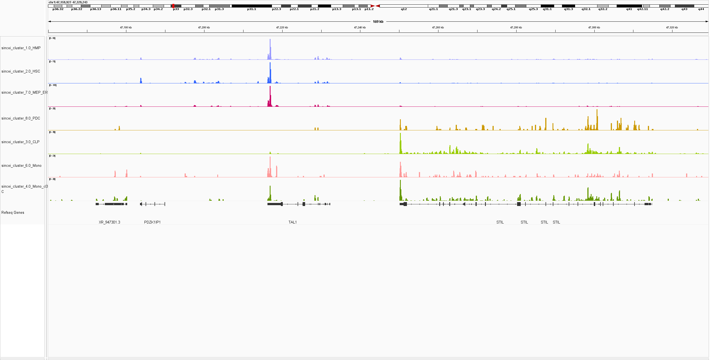

Analysis of 10x genomics scRNA-seq data using sincei
====================================================

The data used here is part of our 10x genomics multiome tutorial,
`described here <sincei_tutorial_10x.rst>`__

We will use the BAM file, barcodes and peaks.bed file obtained using the
**cellrange-arc** workflow. Alternatively, the BAM file (tagged with
cell barcode) and peaks.bed can be obtained from a custom mapping/peak
calling workflow, and the list of filtered cell barcodes can be obtained
using sincei (see the parent tutorial for explanation).

Define common bash variables:

.. code:: bash

   # create dir
   mkdir sincei_output/rna

2. Quality control - I (read-level)
-----------------------------------

In order to define high quality cells, we can use the read-level quality
statistics from scFilterStats. There could be several indications of low
quality cells in this data, such as:

-  high PCR duplicates (marked by cellranger workflow, detected using
   ``--samFlagExclude``)
-  high fraction of reads aligned to blacklisted regions (filtered using
   ``--blacklist``)
-  high fraction of reads with poor mapping quality (filtered using
   ``--minMappingQuality``)
-  very high/low GC content of the aligned reads, indicating reads
   mostly aligned to low-complexity regions (filtered using
   ``--GCcontentFilter``)
-  high level of secondary/supplementary alignments (filtered using
   ``--samFlagExclude/Include``)

.. code:: bash

  for r in 1 2
  do
      dir=cellranger_output_rep${r}/outs/
      bamfile=${dir}/gex_possorted_bam.bam
      barcodes=${dir}/filtered_feature_bc_matrix/barcodes.tsv.gz
      # from sincei or cellranger output
      zcat ${barcodes} > ${dir}/filtered_barcodes.txt scFilterStats -p 20
      –region chr1 \
      –GCcontentFilter ‘0.2,0.8’ \
      –minMappingQuality 10 \
      –samFlagExclude 256 –samFlagExclude 2048 \
      –barcodes ${dir}/filtered_barcodes.txt \
      --cellTag CB \
      --label rna_rep${r}
      -o sincei_output/rna/scFilterStats_output_rep${r}.txt
      -b ${bamfile}
  done

`scFilterStats` summarizes these outputs as a table, which can then be
visualized using the `MultiQC tool <https://multiqc.info/docs/>`__, to select
appropriate list of cells to include for counting.

.. code:: bash

   multiqc sincei_output/rna/ # results in multiqc_report.html

3. Signal aggregation (counting reads)
--------------------------------------

Below we use sincei to aggregate signal from single-cells. For the gene
expression data, it makes sense to aggregate signal from genes only. For
this we can use a GTF file, which defines gene annotations.

If needed, we can use the same parameters as in ``scFilterStats`` to
count only high quality reads from our whitelist of barcodes.

.. code:: bash

  ## Download the GTF file
  curl -o sincei_output/hg38.gtf.gz \
  http://hgdownload.soe.ucsc.edu/goldenPath/hg38/bigZips/genes/hg38.refGene.gtf.gz && gunzip sincei_output/hg38.gtf.gz

  # count reads on the GTF file
  for r in 1 2 do dir=cellranger_output_rep${r}/outs/
      bamfile=${dir}/gex_possorted_bam.bam
      barcodes=${dir}/filtered_barcodes.txt scCountReads features -p 20
      –BED sincei_output/hg38.gtf –cellTag CB –minMappingQuality 10 \
      –samFlagExclude 256 –samFlagExclude 2048  -bc ${barcodes} --cellTag CB \
      -o sincei_output/rna/scCounts_rna_genes_rep${r}
      –label rna_rep${r}
      -b ${bamfile}
  done

  # Number of bins found: 74538

4. Quality control - II (count-level)
-------------------------------------

Even though we already performed read-level QC before, the counts distribution on our specified regions (bins/genes/peaks) could be different from the whole-genome stats.

**scCountQC**, with the `--outMetrics` option, outputs the count statistics at region and cell level (labelled as <prefix>.regions.tsv and <prefix>.cells.tsv).
Just like `scFilterStats`, these outputs can then be visualized using the
`MultiQC tool <https://multiqc.info/docs/>`__, to select appropriate metrics to
filter out the unwanted cells/regions.

.. code:: bash

   # list the metrics we can use to filter cells/regions
   for r in 1 2; do scCountQC -i sincei_output/rna/scCounts_rna_genes_rep${r}.loom --describe; done

   # export the single-cell level metrices
   for r in 1 2; do scCountQC -i sincei_output/rna/scCounts_rna_genes_rep${r}.loom \
   -om sincei_output/rna/countqc_rna_genes_rep${r} & done

   # visualize output using multiQC
   multiqc sincei_output/rna/ # see results in multiqc_report.html

In total >74500 genes have been detected in >13.7K cells here.

Below, we perform a basic filtering using **scCountQC**. We exclude the
cells with <500 and >10000 detected genes (``--filterRegionArgs``).
Also, we exclude the genes that are detected in too few cells (<100) or
too many (approax >90%) of cells (``--filterCellArgs``).

.. code:: bash

  for r in 1 2 do scCountQC -i
  sincei_output/rna/scCounts_rna_genes_rep\ :math:`{r}.loom \
  -o sincei_output/rna/scCounts_rna_genes_filtered_rep`\ {r}.loom
  –filterRegionArgs “n_cells_by_counts: 100, 6000”
  –filterCellArgs “n_genes_by_counts: 500, 15000” done

  ## rep 1
  #Applying filters
  #Remaining cells: 5314
  #Remaining features: 48219

  ## rep 2
  #Applying filters
  #Remaining cells: 4894
  #Remaining features: 48660

5. Combine counts for the 2 replicates
--------------------------------------

While it's useful to perform count QC seperately for each replicate, the counts can now be combined for downstream analysis.

We provide a tool `scCombineCounts`, which can concatenate counts for cells based on common features. Concatenating the filtered cells for the 2 replicates would result in a total of >12K cells.

.. code:: bash

   scCombineCounts \
   -i sincei_output/rna/scCounts_rna_genes_filtered_rep1.loom \
   sincei_output/rna/scCounts_rna_genes_filtered_rep2.loom \
   -o sincei_output/rna/scCounts_rna_genes_filtered.merged.loom \
   --method multi-sample --labels rep1 rep2
   #Combined cells: 10208
   #Combined features: 48059

5. Dimentionality reduction and clustering
------------------------------------------

Finally, we will apply glmPCA to this data, assuming the data follows a
poisson distribution (which is nearly appropritate for count-based data
such as scRNA-seq), we will reduce the dimentionality of the data to 20
principle components (the default), followed by a graph-based (louvain)
clustering of the output.

.. code:: bash

    scClusterCells -i sincei_output/rna/scCounts_rna_genes_filtered.merged.loom \
    -m glmPCA -gf poisson --clusterResolution 1 \
    -op sincei_output/rna/scClusterCells_UMAP.png \
    -o sincei_output/rna/scCounts_rna_genes_clustered.loom

    # Coherence Score:  Coherence Score:  -0.9893882070519782
    # also produces the tsv file "sincei_output/rna/scClusterCells_UMAP.tsv"

(optional) Confirmation of clustering using metadata
~~~~~~~~~~~~~~~~~~~~~~~~~~~~~~~~~~~~~~~~~~~~~~~~~~~~

Below, we will load this data in R and compare it to the cell metadata
provided with our files to see if our clustering separates celltypes in
a biologically meaningful way.

We can color our UMAP output from ``scClusterCells`` with the cell-type
information based on the metadata provided by the original authors.

.. code:: r

    library(dplyr)
    library(magrittr)
    library(ggplot2)
    library(patchwork)

    umap <- read.delim(“sincei_output/rna/scClusterCells_UMAP.tsv”) meta <-
    read.csv(“metadata_cd34_rna.csv”, row.names = 1)
    umap$celltype <- meta[gsub("rep1_|rep2_", "", umap`\ Cell_ID),
    “celltype”]

    # keep only cells with published labels

    umap %<>% filter(!is.na(celltype)) # remove clusters with low number of
    cells cl = umap %>% group_by(cluster) %>%
    summarise(Cell_ID = dplyr::n()) %>%
    filter(Cell_ID < 50) %>% .$cluster umap %<>%
    filter(!(cluster %in% cl))

    # make plots
    df_center <- group_by(umap, cluster) %>%
    summarise(UMAP1 = mean(UMAP1),  UMAP2 = mean(UMAP2))
    df_center2 <- group_by(umap, celltype) %>%
    summarise(UMAP1 = mean(UMAP1), UMAP2 = mean(UMAP2))

    # colors for metadata (8 celltypes)

    col_pallete <- RColorBrewer::brewer.pal(8, “Paired”)
    names(col_pallete) <- unique(umap$celltype) # grey is for NA

    # colors for sincei UMAP (10 clusters)

    colors_cluster <- RColorBrewer::brewer.pal(10, “Paired”)
    names(colors_cluster) <- sort(unique(umap$cluster))

    p1 <- umap %>% ggplot(., aes(UMAP1, UMAP2, color=factor(cluster),
    label=cluster)) + geom_point() +
    geom_label(data = df_center, aes(UMAP1, UMAP2)) +
    scale_color_manual(values = colors_cluster) +
    theme_void(base_size = 12) + theme(legend.position = “none”) +

    p2 <- umap %>% filter(!is.na(celltype)) %>% ggplot(., aes(UMAP1, UMAP2,
    color=factor(celltype), label=celltype)) + geom_point() +
    geom_label(data = df_center2, aes(UMAP1, UMAP2)) +
    scale_color_manual(values = col_pallete) + labs(color=“Cluster”) +
    theme_void(base_size = 12) + theme(legend.position = “none”) +
    ggtitle(“Published Cell Types”)

    pl <- p1 + p2
    ggsave(plot=pl, “sincei_output/rna/UMAP_compared_withOrig.png”,
    dpi=300, width = 11, height = 6)

The figure above shows that we can easily replicate the expected cell-type
results from the scRNA-seq data using **sincei**. However there are some
interesting differences, especially, a separation of the CLP cluster into 2 clusters,
where one of these cluster is similar to the annotated pDC.

This was done using basic pre-processing steps, therefore the better cell/region filtering and optimizing the analysis parameters.

6. Creating bigwigs and visualizing signal on IGV
-------------------------------------------------

For further exploration of data, It's very useful to create in-silico bulk
coverage files (bigwigs) that aggregate the signal across cells in our clusters.
The tool **scBulkCoverage** takes sincei clustered `.tsv` file, along with the
corresponding BAM files, and aggregate the signal to create these bigwigs.

The parameters here are same as other sincei tools that work on BAM files,
except that we can ask for a normalized bulk signal (specified using
`--normalizeUsing` option) . Below, we produce CPM-normalized bigwigs with 100 bp bins.

.. code:: bash

   scBulkCoverage -p 20 --cellTag CB --region chr1 \
   --normalizeUsing CPM --binSize 100 \
   --minMappingQuality 10 --samFlagExclude 2048 \
   -b cellranger_output_rep1/outs/gex_possorted_bam.bam \
   cellranger_output_rep2/outs/gex_possorted_bam.bam \
   --labels rep1_rna_rep1 rep2_rna_rep2 \
   -i sincei_output/rna/scClusterCells_UMAP.tsv \
   -o sincei_output/rna/sincei_cluster
   # creates 6 files with names "sincei_cluster_<X>.bw" where X is 0, 1... 9

We can now inspect these bigwigs on IGV. Looking at the region around one of the markers described in the
original manuscript, **TAL1**, we can see that the CLP (lyphoid) and pDCs lack it's expression, while the
myloid cells and HSCs have the signal. The neighboring gene STIL, which is involved in cell-cycle regulation
is not expressed in the highly proliferative HSC/HMP/MEP cell clusters. Overall this confirms that the signal
coverage extracted from our clusters broadly reflects the biology of the underlying cell types.

