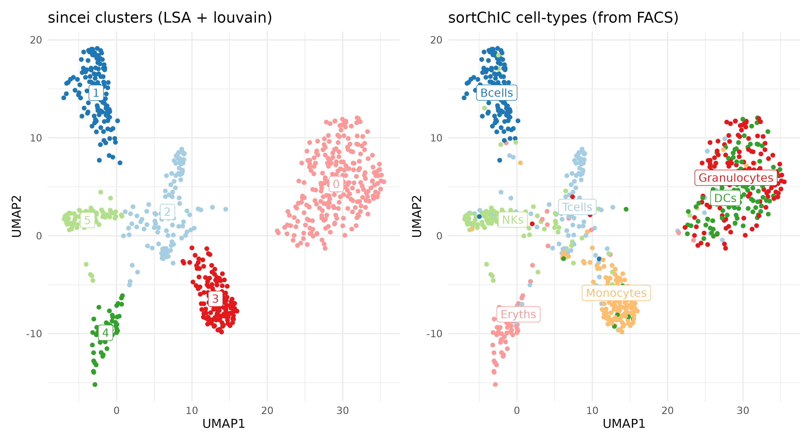
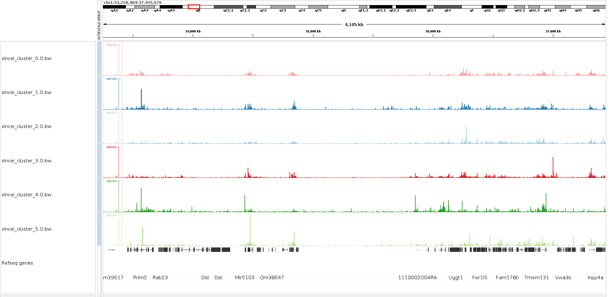

Analysis of sc-sortChIC data using sincei
=========================================

Below, we will demonstrate how we can use sincei to explore the data from the protocol single-cell sortChIC, presented in `Zeller, Yueng et.al. <https://www.nature.com/articles/s41588-022-01260-3>`__. This dataset includes BAM files that represent MNase cuts targetted at **H3K27me1** histone mark in single-cells from adult mouse bone marrow, sorted into 384 well plates. We will also use a metadata file that contain the cell labels defined using celltype-specific surface markers from FACS. This will provide independent confirmation that our clustering captures known cell-types.

1. Download the example dataset
-------------------------------

The test data here contains:

-  **4x BAM files** (indexed): contain data from 4x 384-well plates,
   reads are taken from **chromosome 1** (mm10/GRCm38)
-  **mm10_chr1.2bit:** 2-bit file storing the sequence information for
   mouse chromosome 1
-  **mm10_blacklist.bed:** blacklisted regions to avoid
-  **sortChIC_barcodes.txt:** barcodes corresponding to the 384-well
   plate
-  **metadata.txt:** metadata file that defines cell types from FACS
   label

.. code:: bash

    mkdir sortchic_testdata && cd sortchic_testdata && \
    wget -O sortChIC_testdata.zip https://figshare.com/ndownloader/articles/23544774/versions/2 && \
    unzip sortChIC_testdata.zip && \
    tar -xvzf sortChIC_testdata.tar.gz ## releases 12 files

    rm sortChIC_testdata.tar.gz sortChIC_testdata.zip && cd ../ # cleanup

    ## save as bash variables

    blacklist=sortchic_testdata/mm10_blacklist.bed
    barcodes=sortchic_testdata/sortChIC_barcodes.txt
    genome=sortchic_testdata/mm10_chr1.2bit
    bamfiles=sortchic_testdata/\*.bam

2. Quality control - I (read-level)
-------------------------------------

In order to define high quality cells, we can use the read-level quality statistics from :ref:`scFilterStats`. There could be several indications of low quality cells in this data, such as:

-   high PCR duplicates (filtered using `--duplicateFilter`)
-   high fraction of reads aligned to blacklisted regions (filtered using
    `--blacklist`)
-   high fraction of reads with poor mapping quality (filtered using
    `--minMappingQuality`)
-   vey high/low GC content of the aligned reads, indicating reads mostly
    aligned to low-complexity regions (filtered using `--GCcontentFilter`)
-   high level of secondary/supplementary alignments (filtered using
    `--samFlagExclude/Include`)

.. code:: bash

   scFilterStats -p 20 --motifFilter 'A,TA'  \
   --minAlignedFraction 0.6 --GCcontentFilter '0.2,0.8' \
   --minMappingQuality 10 \
   --duplicateFilter 'start_bc_umi' \
   --samFlagInclude 64 --samFlagExclude 256 --samFlagExclude 2048 \
   --genome2bit ${genome} \
   --barcodes ${barcodes} \
   -bl ${blacklist}  \
   --smartLabels -o sincei_output/scFilterStats_output.txt \
   -b ${bamfiles}

``scFilterStats`` summarizes these outputs as a table, which can then be
visualized using the `MultiQC tool <https://multiqc.info/docs/>`__, to
select appropriate list of cells to include for counting.

.. code:: bash

    # visualize output using multiQC
    multiqc sincei_output # see results in multiqc_report.html

3. Signal aggregation (counting reads)
--------------------------------------

Below we aggregate signal from single-cells in 50-kb bins from ``chromosome 1`` using the tool :ref:`scCountReads`. If needed, we can use the same parameters as in :ref:`scFilterStats` to count only high quality reads from our whitelist of barcodes.

We remove duplicates by matching the start position, barcode and UMI between reads (``--duplicateFilter``). ``start_bc_umi`` is the right choice here, as the sortChIC protocol contains PCR duplicates, as well as IVT duplicates, which do not necessarily have the same fragment “end” position in the genome. We avoid counting reads in blacklisted regions of the mouse genome (``--blacklist``), and let the tool figure out sample names from file labels (``--smartLabels``)

Note: Sam flag filtering is applied before duplicate filtering. Note: All read-filtering is performed first, then the remaining reads are extended/centered before the coverage is calculated. Therefore, always specify ``--samFlagInclude 64`` to only count paired-end reads once (even after read extension). Note: If you deduplicate using read start+end, the chimeric reads with the same UMI+barcode would be counted as unique the start position of second mate is used in those cases.

.. code:: bash

    scCountReads bins -p 20 --binSize 50000 --cellTag BC --region chr1 \
    --minMappingQuality 10 --samFlagInclude 64 --samFlagExclude 2048 \
    --duplicateFilter 'start_bc_umi' --extendReads \
    -bl ${blacklist} -bc ${barcodes} \
    -o sincei_output/scCounts_50kb_bins \
    --smartLabels -b ${bamfiles}
    # Number of bins found: 3923

4. Quality control - II (count-level)
-------------------------------------

After counting, it’s recommended to perform QC of these counts, in order to filter regions and cells that do not get enough counts, or have low enrichment of counts. Even though we already performed read-level QC before, the counts distribution on our specified regions (bins/genes/peaks) could be different from the whole-genome stats.

The tool :ref:`scCountQC` can be used for count-level QC and filtering of count data. With the ``--outMetrics`` option, the tool outputs the count statistics at region and cell level (labelled as ``<prefix>.regions.tsv`` and ``<prefix>.cells.tsv``). Just like :ref:`scFilterStats`, these outputs can then be visualized using the `MultiQC tool <https://multiqc.info/docs/>`__, to select appropriate metrics to filter out the unwanted cells/regions.

.. code:: bash

    # list the metrics we can use to filter cells/regions
    scCountQC -i sincei_output/scCounts_50kb_bins.h5ad --describe

    # export the single-cell level metrices
    scCountQC -i sincei_output/scCounts_50kb_bins.h5ad \
    -om sincei_output/countqc_50kb_bins

    # visualize output using multiQC
    multiqc sincei_output # see results in multiqc_report.html

Below, we perform a basic filtering using :ref:`scCountQC`. We exclude the cells with low or very high counts (using ``--filterRegionArgs``). Also, we exclude the regions that are detected in too few or too many cells (using ``--filterCellArgs``).

.. code:: bash

   scCountQC -i sincei_output/scCounts_50kb_bins.h5ad \
   -o sincei_output/scCounts_50kb_bins_filtered.h5ad \
   --filterRegionArgs "n_cells_by_counts: 50, 2000" \
   --filterCellArgs "n_genes_by_counts: 100, 3000"
   # Applying filters
   # Remaining cells: 1333
   # Remaining features: 2561

5. Dimensionality reduction and clustering
------------------------------------------

The tool :ref:`scClusterCells` provides a range of options to reduce the dimensionality of our count data, while preserving biological signal. This can be specified with ``--method`` option. Below, we will use a topic modeling method called Latent Schemantic Analysis to reduce the dimensionality of our data to 20 principle components (the default). The tool then uses distance between nearest neighbors to perform a graph-based clustering, and presents a UMAP (2-dimention) plot of the output (``--outFileUMAP`` option). This option also creates a tsv file with UMAP coordinates and assigned clusters for each cell in our data.

.. code:: bash

    scClusterCells -i sincei_output/scCounts_50kb_bins_filtered.h5ad \
    --method LSA --clusterResolution 0.7 \
    --outFileUMAP sincei_output/scClusterCells_UMAP.png \
    -o sincei_output/scCounts_50kb_bins_clustered.h5ad
    # Coherence Score:  -1.5
    # also produces the tsv file "sincei_output/scClusterCells_UMAP.tsv"

(optional) Confirmation of clustering using metadata
~~~~~~~~~~~~~~~~~~~~~~~~~~~~~~~~~~~~~~~~~~~~~~~~~~~~

Below, we will load this data in R and compare it to the cell metadata provided with our files to see if our clustering separates celltypes in a biologically meaningful way.

We can color our UMAP output from :ref:`scClusterCells` with the cell-type information based on FACS-sorting from sortChIC.

.. collapse:: Confirmation with metadata

    .. code-block:: r

        umap <- read.delim("sincei_output/scClusterCells_UMAP.tsv", row.names = 1)
        meta <- read.delim("sortchic_testdata/metadata.tsv", row.names = 1)
        umap$celltype_facs <- meta[rownames(umap), "ctype"]

        # keep only FACS-defined labels
        umap %<>% filter(celltype_facs != "AllCells")

        ## make plots
        df_center <- group_by(umap, cluster) %>% summarise(UMAP1 = mean(UMAP1), UMAP2 = mean(UMAP2))
        df_center2 <- group_by(umap, celltype_facs) %>% summarise(UMAP1 = mean(UMAP1), UMAP2 = mean(UMAP2))

        col_pallete <- RColorBrewer::brewer.pal(12, "Paired")
        # colors for sincei UMAP (8 clusters)
        colors_cluster <- col_pallete[1:6]
        names(colors_cluster) <- unique(umap$cluster)

        # colors for metadata (12 celltypes)
        names(col_pallete) <- c("Tcells", "Bcells", "NKs", "DCs", "Eryths", "Granulocytes", "Monocytes")

        p1 <- umap %>%
          ggplot(., aes(UMAP1, UMAP2, color=factor(cluster), label=cluster)) +
          geom_point() + geom_label(data = df_center, aes(UMAP1, UMAP2)) +
          scale_color_manual(values = colors_cluster) + theme_minimal(base_size = 12) +
          theme(legend.position = "none") + ggtitle("sincei clusters (LSA + louvain)")

        p2 <- umap %>%
          ggplot(., aes(UMAP1, UMAP2, color=factor(celltype_facs), label=celltype_facs)) +
            geom_point() + geom_label(data = df_center2, aes(UMAP1, UMAP2)) +
            scale_color_manual(values = col_pallete) +
            labs(color="Cluster") + theme_minimal(base_size = 12) +
            theme(legend.position = "none") +
            ggtitle("sortChIC cell-types (from FACS)")

        pl <- p1 + p2

        ggsave(plot=pl, "sincei_output/UMAP_compared_withOrig.png", dpi=300, width = 11, height = 6)

The figure above shows that we can easily replicate the expected cell-type results from the sortChIC data using **sincei**. This was done using only 1/20th of original data (chromosome 1) and basic pre-processing steps, therefore the results should only improve with full data, better cell/region filtering and optimizing the analysis parameters.

6. Creating bigwigs and visualizing signal on IGV
---------------------------------------------------

For further exploration of data, It's very useful to create in-silico bulk coverage files (bigwigs) that aggregate the signal across cells in our clusters. The tool **scBulkCoverage** takes sincei clustered `.tsv` file, along with the corresponding BAM files, and aggregate the signal to create these bigwigs.

The parameters here are same as other sincei tools that work on BAM files, except that we can ask for a normalized bulk signal (specified using `--normalizeUsing` option) . Below, we prodice CPM-normalized bigwigs with 1kb bins.

.. code:: bash

   scBulkCoverage -p 20 --normalizeUsing CPM --binSize 1000 \
   --minMappingQuality 10 --samFlagInclude 64 --samFlagExclude 2048 \
   --duplicateFilter 'start_bc_umi' --extendReads \
   -b ${bamfiles} --smartLabels \
   -i sincei_output/scClusterCells_UMAP.tsv \
   -o sincei_output/sincei_cluster
   # creates 6 files with names "sincei_cluster_<X>.bw" where X is 0, 1, 2, 3, 4, 5

We can now inspect these bigwigs on `IGV <https://software.broadinstitute.org/software/igv/>`__,. We can clearly see some regions with cell-type specific signal, such as the ones here for genes Prim3 and Tmem131.

