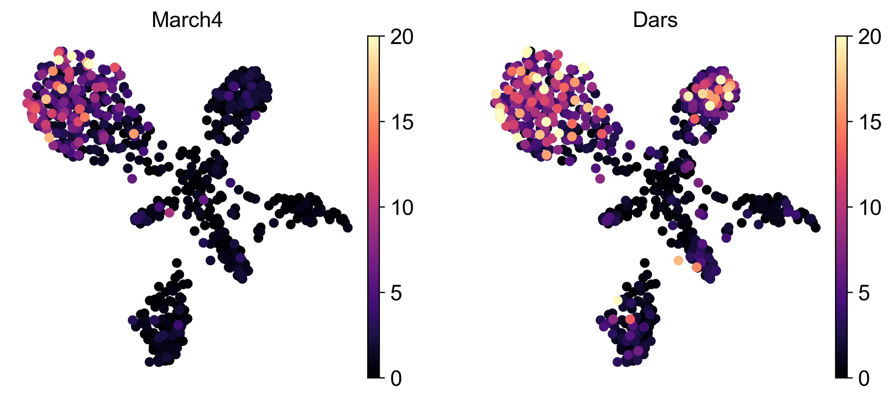
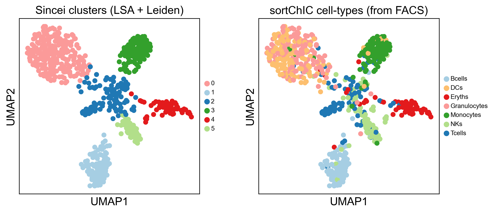
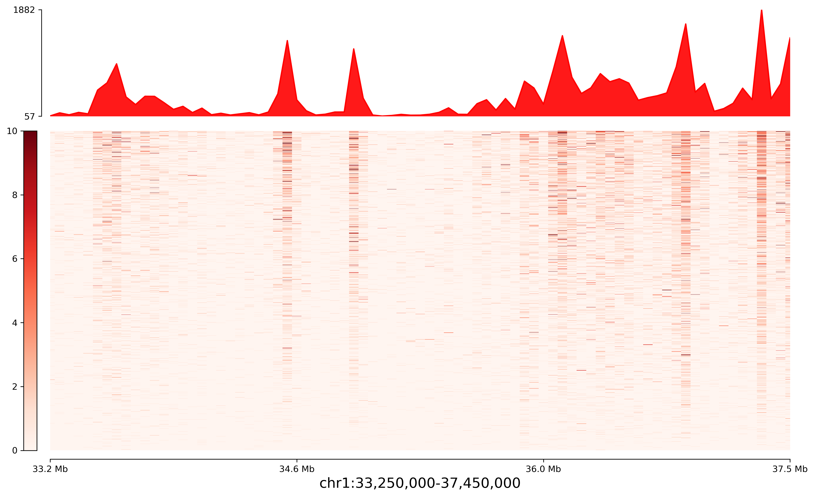
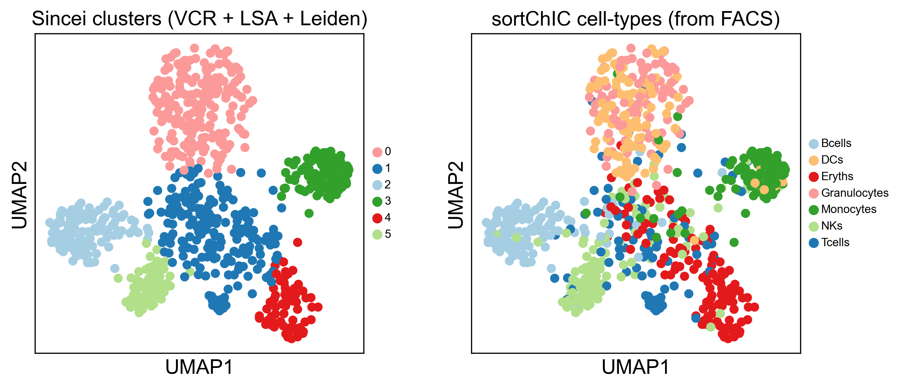
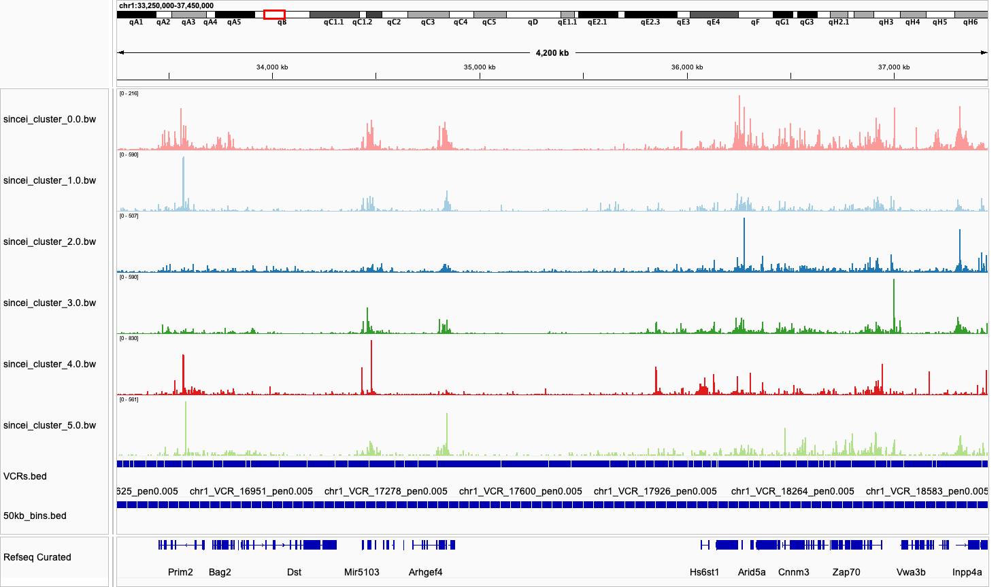

Analysis of sc-sortChIC data using sincei
=========================================

Below, we demonstrate how to use sincei to explore data from the protocol single-cell sortChIC,
presented in `Zeller, Yueng et. al. (2023) <https://www.nature.com/articles/s41588-022-01260-3>`__. This
dataset includes BAM files that contain reads with MNase cuts targetted at the **H3K4me1** histone
mark in single-cells from adult mouse bone marrow. We will also use a metadata file that contain the
cell labels defined using celltype-specific surface markers identified by FACS. This will provide
independent confirmation that our clustering captures known cell-types.

For convenience, we provide a subset of the original data on
`figshare <https://figshare.com/articles/dataset/sortChIC_testdata_package/23544774>`__.

1. Download the example dataset
-------------------------------

The test data contains:

- **4x BAM files** (indexed): contain data from 4x 384-well plates, reads are taken from **chromosome 1** (mm10/GRCm38)
- **sortChIC_barcodes.txt:** barcodes corresponding to the 384-well plate (1 barcode per cell)
- **metadata.tsv:** metadata file that defines cell types from FACS label
- **mm10_chr1.2bit:** 2-bit file storing the sequence information for mouse chromosome 1
- **mm10_chr1_genes.bed:** BED file containing the genomic coordinates for selected chromosome 1 genes
- **mm10_blacklist.bed:** BED file with blacklisted regions to avoid for counting

.. code:: bash

    mkdir sortchic_testdata sincei_output
    cd sortchic_testdata
    # download the dataset manually from figshare: https://figshare.com/articles/dataset/sortChIC_testdata_package/23544774
    # save in sortchic_testdata folder (default file name: 23544774.zip)
    unzip 23544774.zip && rm 23544774.zip && cd ../ ## releases 13 files

    ## save as bash variables
    blacklist=sortchic_testdata/mm10_blacklist.bed
    barcodes=sortchic_testdata/sortChIC_barcodes.txt
    genome=sortchic_testdata/mm10_chr1.2bit
    bamfiles=(sortchic_testdata/*.bam)

2. Quality control - I (read-level)
-------------------------------------

In order to identify high quality cells for our analysis, we can use the read-level quality
statistics from :ref:`scFilterStats`. Low quality cells in this data can be identified using several
criteria, such as:

- high number of PCR duplicates (filtered using `--duplicateFilter`)
- high fraction of reads aligned to blacklisted regions (filtered using `--blacklist`)
- high fraction of reads with poor mapping quality (filtered using `--minMappingQuality`)
- vey high/low GC content of the aligned reads, indicating the reads were mostly aligned to
  low-complexity regions (filtered using `--GCcontentFilter`)
- high level of secondary/supplementary alignments (filtered using `--samFlagExclude/Include`)

Additionally, we will scan reads for the motif 'A,TA', which corresponds to “A” at the 5’-end of the
read and “TA” at 5’-overhang. This is expected from the sortChIC protocol, as MNase cuts 5’ of A
residues, leaving a TA overhang after end-repair.

.. code:: bash

    scFilterStats -p 20 \
        --motifFilter 'A,TA'  \
        --minAlignedFraction 0.6 \
        --GCcontentFilter '0.2,0.8' \
        --minMappingQuality 10 \
        --duplicateFilter 'start_bc_umi' \
        --samFlagInclude 64 \
        --samFlagExclude 256 \
        --samFlagExclude 2048 \
        --genome2bit ${genome} \
        --barcodes ${barcodes} \
        -bl ${blacklist}  \
        --smartLabels \
        -o sincei_output/scFilterStats_output.tsv \
        -b ${bamfiles}

``scFilterStats`` summarizes these outputs as a table, which can then be visualized using the
`MultiQC tool <https://multiqc.info/docs/>`__, to select appropriate list of cells to include for
counting.

.. code:: bash

    # visualize output using multiQC
    multiqc sincei_output # see results in multiqc_report.html

3. Signal aggregation (counting reads)
--------------------------------------

Below we aggregate the signal from single-cells in 50-kb bins from ``chromosome 1`` using the tool
:ref:`scCountReads`. If needed, we can use the same parameters as in :ref:`scFilterStats` to count
only high quality reads from our whitelist of barcodes.

We remove duplicates by matching the start position, barcode and UMI between reads
(``--duplicateFilter``). ``start_bc_umi`` is the right choice here, as the sortChIC protocol
contains PCR duplicates, as well as IVT duplicates, which do not necessarily have the same fragment
“end” position in the genome. We avoid counting reads in blacklisted regions of the mouse genome
(``--blacklist``), and let the tool figure out sample names from file labels (``--smartLabels``).

*NOTE*: Sam flag filtering is applied before duplicate filtering.

*NOTE*: All read-filtering is performed first, then the remaining reads are extended/centered before
the coverage is calculated. Therefore, always specify ``--samFlagInclude 64`` to only count
paired-end reads once (even after read extension).

*NOTE*: If you deduplicate using read start+end, the chimeric reads with the same UMI+barcode would
be counted as unique the start position of second mate is used in those cases.

.. code:: bash

    scCountReads bins -p 20 \
        --binSize 50000 \
        --cellTag BC \
        --region chr1 \
        --minMappingQuality 10 \
        --samFlagInclude 64 \
        --samFlagExclude 2048 \
        --duplicateFilter 'start_bc_umi' \
        --extendReads \
        -bl ${blacklist} \
        -bc ${barcodes} \
        -o sincei_output/scCounts_50kb_bins \
        --smartLabels \
        -b ${bamfiles}
    # Number of bins found: 3923

4. Quality control - II (count-level)
-------------------------------------

After counting, it is recommended to perform QC on these counts, in order to filter regions and
cells that have low counts, or have low enrichment of counts. Even though we already performed
read-level QC before, the counts distribution on our specified regions (bins/genes/peaks) could be
different from the whole-genome stats.

We can run :ref:`scCountQC` on the count data to get various statistics at region and cell level.
Running this tool with the ``--describe`` flag lists the metrics that can be used to filter
cells/regions.

.. code:: bash

    scCountQC -i sincei_output/scCounts_50kb_bins.h5ad --describe

The tool :ref:`scCountQC` can be used for count-level QC and filtering of count data. With the
``--outMetrics`` option, the tool outputs the count statistics at region and cell level (labelled as
``<prefix>.regions.tsv`` and ``<prefix>.cells.tsv``). Just like :ref:`scFilterStats`, these outputs
can then be visualized using the `MultiQC tool <https://multiqc.info/docs/>`__, to select
appropriate metrics to filter out the unwanted cells/regions.

.. code:: bash

    # list the metrics we can use to filter cells/regions
    scCountQC -i sincei_output/scCounts_50kb_bins.h5ad --describe

    # export the single-cell level metrics
    scCountQC -i sincei_output/scCounts_50kb_bins.h5ad \
        -om sincei_output/countqc_50kb_bins

    # visualize output using multiQC
    multiqc sincei_output # see results in multiqc_report.html

Below, we perform some basic filtering using :ref:`scCountQC`. We exclude cells with low or very
high counts (using ``--filterRegionArgs``). We also exclude the regions detected in too few or too
many cells (using ``--filterCellArgs``).

.. code:: bash

    scCountQC -i sincei_output/scCounts_50kb_bins.h5ad \
        -o sincei_output/scCounts_50kb_bins_filtered.h5ad \
        --filterRegionArgs "n_cells_by_counts: 50, 2000" \
        --filterCellArgs "n_genes_by_counts: 100, 3000"
    # Applying filters
    # Cells post-filtering: 1333
    # Features post-filtering: 2561

5. Dimensionality reduction and clustering
------------------------------------------

The tool :ref:`scClusterCells` provides a range of options to reduce the dimensionality of our count
data, while preserving biological signal. This can be specified with ``--method`` option. Below, we
will use a topic modeling method called Latent Semantic Analysis (LSA) to reduce the dimensionality
of our data to 30 topics. The tool then performs Leiden clustering, and presents a
UMAP (dimensionality reduction to 2 dimensions) plot of the output (``--outFileUMAP`` option). This
option also creates a tsv file with the UMAP coordinates and assigned cluster for each cell in our
data.

.. code:: bash

    scClusterCells -i sincei_output/scCounts_50kb_bins_filtered.h5ad \
        --method LSA -n 30 --clusterResolution 0.7 \
        --outFileUMAP sincei_output/scClusterCells_UMAP.png \
        -o sincei_output/scCounts_50kb_bins_clustered.h5ad
    # Coherence Score:  -1.5
    # also produces the tsv file "sincei_output/scClusterCells_UMAP.tsv"

6. Gene-level scoring
------------------------------------------

Next, we can determine the identity of each of our cell clusters by aggregating the H3K4me1 signal
over known genes. We will use the gene coordinates provided in the BED file ``mm10_chr1_genes.bed``
and our binned H3K4me1 anndata.
Each cell will be assigned a score for each gene, which is the sum of the counts in the bins that
overlap with the gene coordinates. Bear in mind that this depends on the bin size used in the
counting step, smaller bins will result in more granular scoring.
:ref:`scScoreFeatures` conserves the clustering, dimension reduction and UMAP information of the
input anndata, so the scores can be plotted on the UMAP obtained from the 50Kb bins.

.. code:: bash

    scScoreFeatures -i sincei_output/scCounts_50kb_bins_clustered.h5ad \
        -f sortchic_testdata/mm10_chr1_genes.bed \
        -o sincei_output/scScores_genes_50kb_bins.h5ad

Plotting the gene scores on our UMAP output from :ref:`scClusterCells` allows us to identify the
cell-types in our clusters based on the distribution of their markers. For example, see the genes
*March4* and *Dars*:

Alternatively, we can use :ref:`scCountReads` again over genes to get the exact  counts for each
gene, and then use :ref:`scCountQC` to filter out low-count genes. However, the additional
information obtained from the clustering will need to be manually transferred from the binned
anndata to the gene-level anndata.

(optional) Validation of clustering using metadata
~~~~~~~~~~~~~~~~~~~~~~~~~~~~~~~~~~~~~~~~~~~~~~~~~~

Below, we load this data in R and compare it to the cell metadata provided with our files to verify
that our clustering separates celltypes in a biologically meaningful way.

We can color our UMAP output from :ref:`scClusterCells` with the cell-type information based on
FACS-sorting from sortChIC.

.. collapse:: Clustering validation (click for Python code)

    .. code-block:: python

        import scanpy as sc
        import pandas as pd
        import matplotlib.pyplot as plt

        metadata = pd.read_csv('sortchic_testdata/metadata.tsv', sep='\t', header=0, index_col=0)

        adata = sc.read_h5ad('sincei_output/scCounts_50kb_bins_clustered.h5ad')

        adata.obs = adata.obs.merge(metadata['ctype'], left_index=True, right_index=True, how='left')

        adata = adata[adata.obs['ctype'] != "AllCells", :]
        adata = adata[~adata.obs['ctype'].isna(), :]

        adata.obs["ctype"] = adata.obs["ctype"].astype("category")

        ctype_colors = {
            "Bcells": "#1f77b4",
            "Tcells": "#e377c2",
            "NKs": "#8c564b",
            "Monocytes": "#2ca02c",
            "Granulocytes": "#ff7f0e",
            "Eryths": "#d62728",
            "DCs": "#9467bd",
        }

        # make plots
        sc.pl.umap(adata, color=["leiden", "ctype"],
           title=["Sincei clusters (LSA + Leiden)", "sortChIC cell-types (from FACS)"],
           legend_loc="right margin", legend_fontsize=8, return_fig=True)

        for ax in plt.gcf().axes:
            ax.title.set_size(fontsize=16)

        plt.savefig('sincei_output/UMAP_compared_withOrig.png', dpi=300, bbox_inches='tight')

.. collapse:: Clustering validation (click for R code)

    .. code-block:: r

        umap <- read.delim("sincei_output/scClusterCells_UMAP.tsv", row.names = 1)
        meta <- read.delim("sortchic_testdata/metadata.tsv", row.names = 1)
        umap$celltype_facs <- meta[rownames(umap), "ctype"]

        # keep only FACS-defined labels
        umap %<>% filter(celltype_facs != "AllCells")

        ## make plots
        df_center <- group_by(umap, cluster) %>% summarise(UMAP1 = mean(UMAP1), UMAP2 = mean(UMAP2))
        df_center2 <- group_by(umap, celltype_facs) %>% summarise(UMAP1 = mean(UMAP1), UMAP2 = mean(UMAP2))

        col_pallete <- RColorBrewer::brewer.pal(12, "Paired")
        # colors for sincei UMAP (8 clusters)
        colors_cluster <- col_pallete[1:6]
        names(colors_cluster) <- unique(umap$cluster)

        # colors for metadata (12 celltypes)
        names(col_pallete) <- c("Tcells", "Bcells", "NKs", "DCs", "Eryths", "Granulocytes", "Monocytes")

        p1 <- umap %>%
          ggplot(., aes(UMAP1, UMAP2, color=factor(cluster), label=cluster)) +
          geom_point() + geom_label(data = df_center, aes(UMAP1, UMAP2)) +
          scale_color_manual(values = colors_cluster) + theme_minimal(base_size = 12) +
          theme(legend.position = "none") + ggtitle("sincei clusters (LSA + Leiden)")

        p2 <- umap %>%
          ggplot(., aes(UMAP1, UMAP2, color=factor(celltype_facs), label=celltype_facs)) +
            geom_point() + geom_label(data = df_center2, aes(UMAP1, UMAP2)) +
            scale_color_manual(values = col_pallete) +
            labs(color="Cluster") + theme_minimal(base_size = 12) +
            theme(legend.position = "none") +
            ggtitle("sortChIC cell-types (from FACS)")

        pl <- p1 + p2

        ggsave(plot=pl, "sincei_output/UMAP_compared_withOrig.png", dpi=300, width = 11, height = 6)

The figure above shows that we can easily replicate the expected cell-type results from the sortChIC
data using **sincei**. This was done using only 1/20th of original data (chromosome 1) and basic
pre-processing steps, therefore the results should only improve with full data, better cell/region
filtering and optimizing the analysis parameters.

(optional) Fast visualization of genomic regions
~~~~~~~~~~~~~~~~~~~~~~~~~~~~~~~~~~~~~~~~~~~~~~~~~

Using :ref:`scPlotRegion` we can get a first idea of the signal distribution in our data for a given
genomic region. This tool takes the anndata produced by :ref:`scCountReads` and produces a plot of
the total signal and the per-cell signal in the region.

*Note:* the resolution of the plot is determined by the bin size used in :ref:`scCountReads`. For
example, if we used 50kb bins, the plot will be at 50kb resolution. If we used 2kb bins, the plot
will be at 2kb resolution.

.. code:: bash

    scPlotRegion -i sincei_output/scCounts_50kb_bins_filtered.h5ad \
        --region chr1:33250000-37450000 \
        --hmapMax 10 \
        -o sincei_output/scPlotRegion_sortChIC.png

(optional) Finding informative features for clustering
~~~~~~~~~~~~~~~~~~~~~~~~~~~~~~~~~~~~~~~~~~~~~~~~~~~~~~

Instead of using 50kb bins, we can also use smaller bins (2kb) to find the most informative regions
for clustering. The tool :ref:`scFindVCRs` identifies the variable regions in the genome by
combining these smaller bins into larger variable regions. We can then use these variable regions to
produce a dimensionality reduction and clustering to separate our cell types.

First, we produce a 2kb bin anndata of our dataset.

.. code:: bash

    scCountReads bins -p 20 \
        --binSize 2000 \
        --cellTag BC \
        --region chr1 \
        --minMappingQuality 10 \
        --samFlagInclude 64 \
        --samFlagExclude 2048 \
        --duplicateFilter 'start_bc_umi' \
        --extendReads \
        -bl ${blacklist} \
        -bc ${barcodes} \
        -o sincei_output/scCounts_2kb_bins \
        --smartLabels \
        -b ${bamfiles}
    # Number of bins found: 96883

We then run :ref:`scFindVCRs`. We pass the anndata, its binsize, and the value (or multiple values) for the
penalty parameter to the tool. The output is a BED file containing the resulting VCRs. For more
information on the VCR algorithm, consult :ref:`scFindVCRs`.

.. code:: bash

    scFindVCRs -i sincei_output/scCounts_2kb_bins.h5ad \
        --binSize 2000 \
        --penalty 0.005 \
        -o sincei_output/VCRs.bed

We can use :ref:`scScoreFeatures` to make an anndata with our VCRs as features. We use the 2kb bin
anndata and the VCR BED file as input. Since the VCRs will always be larger or equal than the bins
used to find them, and their boundaries will match, this is equivalent to running
:ref:`scCountReads` using the VCR BED file to count reads in features.

.. code:: bash

    scScoreFeatures -i sincei_output/scCounts_2kb_bins.h5ad \
            -f sincei_output/VCRs.bed \
            -o sincei_output/scScores_VCRs_2kb_bins.h5ad

Next, we filter the low and high count cells and regions, and cluster the filtered data using.

.. code:: bash

    scCountQC -i sincei_output/scScores_VCRs_2kb_bins.h5ad \
        -o sincei_output/scScores_VCRs_2kb_bins_filtered.h5ad \
        --filterRegionArgs "n_cells_by_counts: 200, 2000" \
        --filterCellArgs "n_genes_by_counts: 100, 10000"
    # Applying filters
    # Cells post-filtering: 1374
    # Features post-filtering: 13475

    scClusterCells -i sincei_output/scScores_VCRs_2kb_bins_filtered.h5ad \
        --method LSA -n 30 --clusterResolution 0.7 \
        --outFileUMAP sincei_output/scClusterCells_VCR_UMAP.png \
        -o sincei_output/scScores_VCRs_2kb_bins_clustered.h5ad
    # Coherence Score:  -0.7
    # also produces the tsv file "sincei_output/scClusterCells_VCR_UMAP.tsv"

The resulting UMAP and clusters tell a similar story as our previous results, from LSA on 50kb
filtered bins.

Choosing what features (bins, genes, peaks, VCRs, etc.) and dimensionality method reduction to use
depends on the dataset under scrutiny. We recommend exploring different methods to find what works
well for your data.

7. Creating bigwigs and visualizing signal on IGV
---------------------------------------------------

For further exploration of data, it can be useful to create pseudo-bulk coverage files (bigwigs)
that aggregate the signal across cells in our each of our clusters. The tool :ref:`scBulkCoverage`
takes the clustering information `.tsv` file produced by :ref:`scClusterCells`, along with the
corresponding BAM files, and aggregates the signal to create these bigwigs.

The parameters here are same as other sincei tools that work on BAM files, except that we can output
normalized bulk signal (specified using `--normalizeUsing` option) . Below, we produce
CPM-normalized bigwigs at 1kb resolution.

.. code:: bash

    scBulkCoverage -p 20 \
        --normalizeUsing CPM \
        --binSize 1000 \
        --minMappingQuality 10 \
        --samFlagInclude 64 \
        --samFlagExclude 2048 \
        --duplicateFilter 'start_bc_umi' \
        --extendReads \
        -b ${bamfiles} --smartLabels \
        -i sincei_output/scClusterCells_UMAP.tsv \
        -o sincei_output/sincei_cluster
    # creates 6 files with names "sincei_cluster_<X>.bw" where X is 0, 1, 2, 3, 4, 5

We can now inspect our bigwigs on `IGV <https://software.broadinstitute.org/software/igv/>`__.
We can clearly see some regions with cell-type specific signal, such as the ones here for genes
Prim2 and Mir5103.

Note that VCRs follow the signal more closely than the 50kb bins, and can be used to identify
specific regions in the genome and help with biological interpretation of the data.
