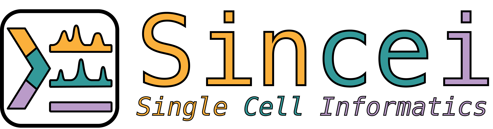

.. image:: https://readthedocs.org/projects/sincei/badge/?version=latest
    :target: https://sincei.readthedocs.io/en/latest/?badge=latest
    :alt: Documentation Status

.. image:: https://img.shields.io/pypi/v/sincei.svg?style=plastic
    :target: https://pypi.org/project/sincei/
    :alt: PyPI Version

.. image:: https://img.shields.io/badge/install%20with-bioconda-brightgreen.svg?style=flat
    :target: http://bioconda.github.io/recipes/sincei/README.html
    :alt: Install with bioconda

====================================================================
A command-line toolkit for exploring single-cell (epi)genomics data.
====================================================================

sincei provides a flexible, easy-to-use command-line interface to work with single-cell data directly from BAM files. It can:

- Aggregate signal in bins, genes or any feature of interest from single-cells.
- Perform read-level and count-level quality control.
- Perform dimensionality reduction and clustering of all kinds of single-cell data (open chromatin, histone marks, methylation, gene expression etc.).
- Create coverage files (bigwigs) for visualization.
- Along with additional tools for visualization, and interpretation/annotation of cells.

sincei is also part of the `scVerse ecosystem <https://scverse.org/>`_, and it's command-line tools can easily be combined with other Python or R packages for further analysis.

For details, please `read our preprint <https://www.biorxiv.org/content/10.1101/2024.07.27.605424v1>`_ describing sincei.

============
Installation
============

sincei is a command line toolkit written in Python and Rust. The stable version of sincei can be installed using `conda <https://conda.io/projects/conda/en/latest/user-guide/install/index.html>`_ , while the development versions can be installed from github via pip.

Installation via bioconda
-------------------------

Create a new conda environment and install sincei using:

.. code-block:: bash

    conda create -n sincei -c bioconda -c conda-forge sincei

*Note:* The dependency `mctorch-lib` required for `scClusterCells` is currently not avilable on conda, therefore, to use `scClusterCells`, we recommend installing it separately via pip or uv.

.. code-block:: bash

    # install mctorch-lib
    (sincei): uv pip install mctorch-lib
    (sincei): scClusterCells --help

Installation via github
-----------------------

Create a new conda environment and install sincei from GitHub using pip or uv:

.. code-block:: bash

    conda create -n sincei python=3.12
    conda activate sincei
    (sincei): uv pip install git+https://github.com/bhardwaj-lab/sincei.git@master#egg=sincei

Getting Help
------------

* For questions related to usage, or suggesting changes/enhancements please use our `GitHub discussion board <https://github.com/bhardwaj-lab/sincei/discussions>`__ . To report bugs, please create an issue on `our GitHub repository <https://github.com/bhardwaj-lab/sincei>`_

**Please Note that sincei is under active development.** We expect significant changes/updates as we move towards our first major release (1.0).

Command line tools available in sincei
--------------------------------------

Tools for a typical single-cell analysis workflow

========================== ============================================================================================================
tool                                 description
========================== ============================================================================================================
:ref:`scFilterBarcodes`        Identify and filter cell barcodes from BAM file (for droplet-based single-cell seq).
:ref:`scFilterStats`           Produce per-cell statistics after filtering reads by user-defined criteria.
:ref:`scCountReads`            Counts reads for each barcode on genomic bins or user-defined features.
:ref:`scCountQC`               Perform quality control and filter the output of scCountReads.
:ref:`scFindVCRs`              Call variable chromatin regions (VCRs) from binned chromatin data.
:ref:`scScoreFeatures`         Calculate gene activity scores from chromatin features/bins.
:ref:`scCombineCounts`         Concatenate/merge the counts from different samples/batches or different modalities.
:ref:`scClusterCells`          Perform dimensionality reduction and clustering on the output of scCountReads.
:ref:`scBulkCoverage`          Get pseudo-bulk coverage per group using a user-supplied cell->group mapping (output of scClusterCells).
:ref:`scPlotRegion`            Plot genomic regions of interest from sincei output.
:ref:`scExportSignal`          Export sincei-supportred .h5ad (anndata) object to other formats.
========================== ============================================================================================================

Contents:
---------

.. toctree::
   :maxdepth: 2

   content/list_of_tools
   content/tutorials
   content/modules
   content/news
